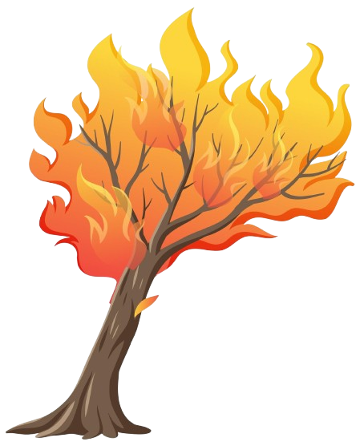
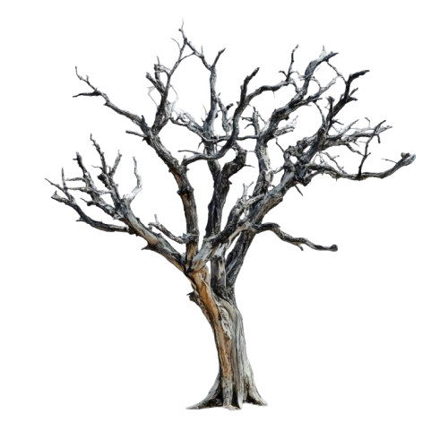
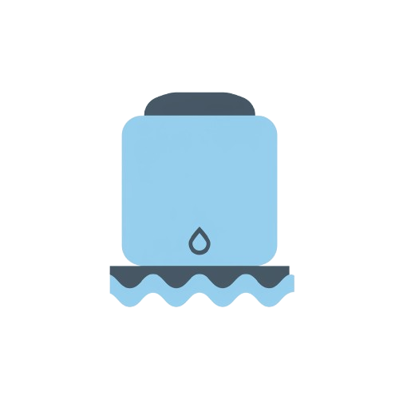

# Simulador de Propagação de Incêndios Florestais 🔥🦌
[](LICENSE)
[](https://isocpp.org/)
[](pratica.pdf)
[](makefile)

## Introdução 📜
Simulador desenvolvido para a disciplina de AEDS (Algoritmos e Estruturas de Dados) que modela a propagação de incêndios em uma floresta representada por uma matriz **100x100**, com mecanismos de interação animal-ambiente.  

| Valor | Estado                          | Representação Visual           |
|-------|---------------------------------|---------------------------------|
| `0`   | Área segura                     |   |
| `1`   | Árvore saudável                 |        |
| `2`   | Árvore em chamas                |          |
| `3`   | Árvore queimada                 |    |
| `4`   | Reservatório de água            |         |

---
###  Demonstração Visual 🎥
<div align="center">
  
  <br>
  <em>Propagação do fogo com interação do animal (GIF gerado via IA)</em>
</div>


### Mecânicas Principais 🦌🚒

- **Animal**: Move-se ortogonalmente priorizando água (`4`), apaga fogos adjacentes ao consumir água.

- **Propagação do Fogo**:

- **Sem vento**: Expansão em 4 direções.

- **Com vento**: Direções configuráveis via `config.hpp`.

- **Sistema de Prioridades**: Movimento do animal precede a propagação do fogo.

---

## Metodologia 🛠️

### Estruturas de Dados

- **Matriz Dinâmica**: Representa a floresta com alocação dinâmica para N×M.

- **Classe `Animal`**: Controla posição, histórico de movimentos e interações.

- **Classe `Floresta`**: Gerencia estados da matriz e propagação do fogo.

### Algoritmos

1. **Propagação Iterativa**:

```cpp

for (cada célula em chamas) {

propaga para células adjacentes conforme vento;

atualiza estado para queimada (3);

}

```

2. **Movimento do Animal**:

```cpp

vector<pair<int, int>> direcoes = calcular_melhor_caminho();

if (encontrou_agua) {

apaga_fogos_adjacentes();

atualiza_matriz();

}

```

### Configuração

- Parâmetros ajustáveis em `config.hpp`:

```cpp

bool vento_ativo = true;

vector<string> direcoes_vento = {"cima", "direita"}; // Exemplo

short interaction_limit = 100;

```

---

## Estudo de Caso 📊

### Cenário de Teste (input.dat)

```

5 5 1 1

1 1 1 1 4

1 2 1 1 1

1 1 1 1 4

0 0 1 1 1

1 4 1 0 4

```

### Resultados (output.dat)

```plaintext


=== RESULTADOS DA SIMULAÇÃO ===
Caminho do animal:
(2,0) -> (3,0) -> (4,0) -> (4,1) -> (3,1) -> (2,1)

Total de passos: 6
Encontros com água: 1
Sobreviveu? Sim
===========================


```

### Análise de Desempenho ⚡

| Condição      | Tempo Médio (100 iterações) |

|---------------|-----------------------------|

| Sem vento     | 12.3 ms                     |

| Com vento     | 14.7 ms                     |

---

## Conclusão 🎯

- **Eficiência**: Algoritmo O(N²) adequado para matrizes até 200x200.

- **Melhorias Futuras**:

- Implementação de paralelismo com OpenMP.

- Uso de estruturas de dados espaciais (Quadtree).

---

## Referências 📚

[](pratica.pdf)


---

## Método de Compilação 🖥️

### Pré-requisitos

- Compilador C++ (g++ 11+)

- Make

### Comandos

```bash

# Limpar builds anteriores

make clean

# Compilar projeto

make

# Executar simulação

make run

```

---

### Estrutura do Projeto 📂

```

Simulador-incendio/

├── src/

│   ├── Animal/

│   ├── Config/

│   ├── Floresta/

│   ├── Leitor/

│   └── Simulador/

├── docs/

│   ├── imgs/

│   ├── gifs/

├── data/

│   ├── input.dat

│   └── output.dat

│   └── output_normal.dat

├── Makefile

├── pratica.pdf

└── README.md

```
### Redes Sociais:
<div align="center" style="background-color: #f0f0f0; padding: 20px; border-radius: 10px;">
  <h2 style="color: #0366d6;">🔗 Connect with me</h2>
  <p><strong style="font-size: 18px;">Arthur Mendonça</strong></p>
  <p>
    <a href="https://github.com/ImArthz" target="_blank">
      
    </a>
    <a href="https://twitter.com/Im_Arthz" target="_blank">
      
    </a>
    <a href="https://api.whatsapp.com/send?phone=37988528423" target="_blank">
      
    </a>
    <a href="https://discordapp.com/users/imarthz" target="_blank">
      
    </a>
  </p>
</div>


```
